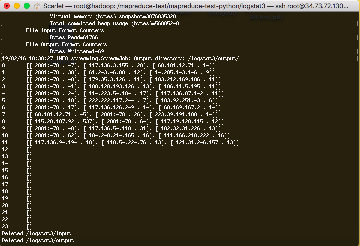
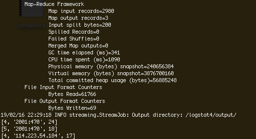

# MapReduce on Google Cloud 

This repo contains two mapreduce programs that run on a 3-node clusters on Google Cloud. The programs are used to process a log file, which contains a streaming file that is read into lines of **IP Address, Time, Type of HTTP Request, Requested File, HTTP Version and Status, etc**.  

## Part I: Top-3 IP address

 Goal: output the top-3 IP addresses with the granularity of an hour. 
 
 ### Design

This program runs two rounds of mapreduce. 

 1) In the 1st round, the program is built on top of **logstat2**. It takes the access.log file, then output the count of each IP addresses within each hour. The result is saved in `/logstat2/output/`. 

 2) In the 2nd round, only the mapper is used. The result of the 1st round mapreduce will be the input of the mapper: 

`/usr/local/hadoop/bin/hdfs dfs -cp /logstat2/output/part-00000 /logstat3/input/`.  

Next, to specify only the mapper and no reducer with:

`-D mapred.reduce.tasks=0`. 

For the mapper program, the input lines are group by hours, and output the top-3 IP addresses for each hour (within the 24 hour range). 

The program first takes input line and seperate each line at the horizontal tab character `\t` and the whitespace `' '` into three strings: `hr, ip, count`. 

Then, converted both `hr` and `count` into numeric values. 

Next, using python container *defaultdict*, the program mapps the value [ip, count] into key `hr`. 

Finally, the program iteratively sort the count within 24 hours, and extracted the top 3-IP addresses with their counts. 

## Part II: A database search

Your program should be able to accept parameters from users, such as 0-1, which means from time 00:00 to 01:00, and output the top-3 IP addresses in the given time period.

Run it along with three other examples, WordCount, Sort, Grep, at the same time, and test fair and capacity schedulers.

 ### Design

This program also runs two rounds of mapreduce. It takes two paramters between 0 to 24, and output the top-3 IP addresses in this time period. 

 In the 1st round, the program is built on top of *logstat2*. It takes the access.log file and output the count of each IP addresses within each hour. The result is saved in */logstat2/output/*. 

In the 2nd round, only mapper is used. Firstly, in the `test.sh` file, The result of first round mapreduce will be the input of the mapper: 
 `/usr/local/hadoop/bin/hdfs dfs -cp /logstat2/output/part-00000 /logstat3/input/` 

Then, I specified that only mapper is used and there is no reducer with:
 `-D mapred.reduce.tasks=0`.  

Next, the mapper takes two parameters of two integer value between 0-24 with:
 `-mapper '../../mapreduce-test-python/logstat4/mapper.py 3 6'` 

Here, the two parameters being passes are **3** and **6**, which means I'd like to output the top-3 IP addresses between 3 to 6 am. 
(p.s. the two paramters are read in as string, but converted into integer in the mapper)

For the mapper `mapper.py`, it read the input lines into a list of lists. For each list of lists, I used list comprehension to filter by the two hour parameters that were given. Then, the subset list is sorted and the top-3 IP addresses are extracted. 

